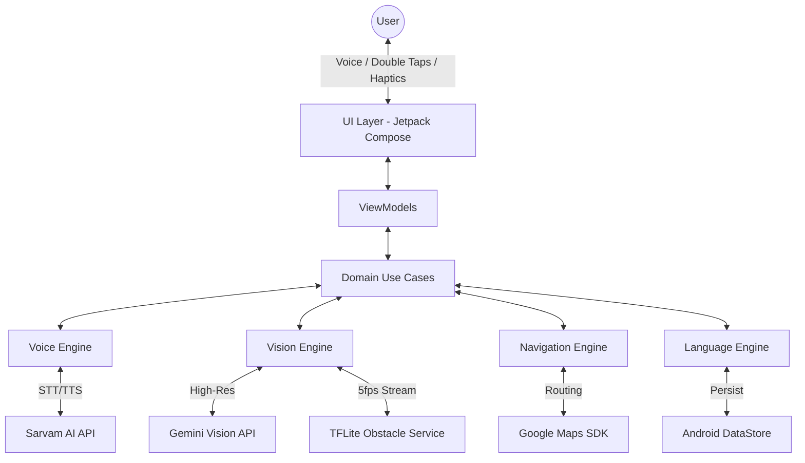

# Assistive Vision - Production-Ready Android Blueprint

## 1. Complete System Architecture Diagram



## 2. Folder Structure & 3. Kotlin Project Structure

```text
com.assistivevision.app
├── di                  # Dependency Injection (Hilt)
├── data
│   ├── api             # Retrofit interfaces (Sarvam, Gemini)
│   ├── repository      # Repository implementations
│   └── local           # DataStore (Language preferences)
├── domain
│   ├── models          # Data classes
│   └── usecases        # Business logic (e.g., ProcessVoiceCommandUseCase)
├── engines             # Modular Engines
│   ├── voice           # STT/TTS wrappers
│   ├── vision          # CameraX & TFLite pipeline
│   └── navigation      # Location & Maps SDK wrappers
├── services            # Background Services
│   └── SafetyService   # Foreground service for continuous obstacle detection
└── ui
    ├── theme           # White theme, typography
    ├── components      # AccessibleButton, CameraPreview
    └── screens
        ├── home
        ├── navigate
        ├── findobject
        ├── describe
        ├── currency
        └── voiceguide
```

## 4. ENV File Setup Example

**DO NOT hardcode keys.** Use `local.properties` in Android:

```properties
# local.properties (Do not commit to VCS)
GEMINI_API_KEY=AIzaSyYourGeminiKeyHere...
SARVAM_API_KEY=YourSarvamKeyHere...
MAPS_API_KEY=AIzaSyYourMapsKeyHere...
```

Access via `BuildConfig` in `build.gradle.kts`:
```kotlin
buildConfigField("String", "GEMINI_API_KEY", "\"${project.findProperty("GEMINI_API_KEY")}\"")
```

## 5. Gemini API Integration Code

```kotlin
class VisionEngine @Inject constructor() {
    private val model = GenerativeModel(
        modelName = "gemini-2.5-flash",
        apiKey = BuildConfig.GEMINI_API_KEY,
        systemInstruction = content { text("You are a calm, concise assistant for a blind person. Max 2 short sentences.") }
    )

    suspend fun analyze(bitmap: Bitmap, prompt: String): Result<String> = runCatching {
        val response = model.generateContent(content { image(bitmap); text(prompt) })
        response.text ?: throw Exception("Empty response")
    }
}
```

## 6. Sarvam AI STT/TTS Integration

```kotlin
interface SarvamApi {
    @POST("v1/text-to-speech")
    suspend fun synthesize(@Header("Authorization") token: String, @Body req: TtsRequest): ResponseBody
}
// Fallback logic in VoiceEngine:
suspend fun speak(text: String, lang: String) {
    try {
        val audio = sarvamApi.synthesize(BuildConfig.SARVAM_API_KEY, TtsRequest(text, lang))
        playAudio(audio)
    } catch (e: Exception) {
        androidNativeTts.speak(text, TextToSpeech.QUEUE_FLUSH, null, null)
    }
}
```

## 7. Google Maps Integration

```kotlin
class NavigationEngine @Inject constructor(private val context: Context) {
    suspend fun getRoute(dest: String): RouteResult {
        // Use Google Directions API via Retrofit or Maps SDK
        // Return turn-by-turn steps
    }
}
```

## 8. Camera + Obstacle Detection Pipeline

```kotlin
// In SafetyService (Foreground Service)
val analyzer = ImageAnalysis.Builder().build().apply {
    setAnalyzer(executor) { proxy ->
        val obstacles = tfLiteModel.detect(proxy)
        if (obstacles.any { it.isDangerous() }) {
            voiceEngine.interruptAndSpeak("Stop. Obstacle ahead.")
        }
        proxy.close()
    }
}
```

## 9. Currency Detection Logic

```kotlin
suspend fun identifyCurrency(bitmap: Bitmap): String {
    val prompt = "Identify the Indian currency note in this image. State only the denomination. If unclear, say 'Currency not clear. Please hold steady.'"
    return visionEngine.analyze(bitmap, prompt).getOrDefault("Currency not clear.")
}
```

## 10. Voice AI Agent Routing Logic

```kotlin
class VoiceGuideViewModel : ViewModel() {
    fun processCommand(transcript: String) {
        when {
            transcript.contains("navigate", ignoreCase = true) -> {
                val dest = extractDestination(transcript)
                _navigationEvent.value = RouteTo.Navigate(dest)
            }
            transcript.contains("find", ignoreCase = true) -> {
                val obj = extractObject(transcript)
                _navigationEvent.value = RouteTo.FindObject(obj)
            }
            transcript.contains("currency", ignoreCase = true) -> _navigationEvent.value = RouteTo.Currency
            transcript.contains("describe", ignoreCase = true) -> _navigationEvent.value = RouteTo.Describe
            else -> voiceEngine.speak("Command not recognized. How can I help you?")
        }
    }
}
```

## 11. Persistent Language Implementation

```kotlin
val Context.dataStore by preferencesDataStore("settings")
val LANG_KEY = stringPreferencesKey("lang")

suspend fun setLanguage(lang: String) { dataStore.edit { it[LANG_KEY] = lang } }
val currentLang: Flow<String> = dataStore.data.map { it[LANG_KEY] ?: "English" }
```

## 12. Accessibility Tap Behavior Implementation

```kotlin
@Composable
fun AccessibleButton(text: String, onClick: () -> Unit, onSpeak: (String) -> Unit) {
    var clickCount by remember { mutableStateOf(0) }
    val context = LocalContext.current

    LaunchedEffect(clickCount) {
        if (clickCount == 1) {
            onSpeak("$text button")
            delay(1500)
            clickCount = 0
        } else if (clickCount == 2) {
            // Haptic feedback
            val vibrator = context.getSystemService(Vibrator::class.java)
            vibrator.vibrate(VibrationEffect.createOneShot(50, VibrationEffect.DEFAULT_AMPLITUDE))
            onClick()
            clickCount = 0
        }
    }

    Button(onClick = { clickCount++ }) { Text(text) }
}
```

## 13. Crash-Proof Permission Handling

```kotlin
@Composable
fun CameraScreen() {
    val permissionState = rememberPermissionState(Manifest.permission.CAMERA)
    
    if (permissionState.status.isGranted) {
        CameraPreview()
    } else {
        LaunchedEffect(Unit) { voiceEngine.speak("Camera permission required.") }
        Button(onClick = { permissionState.launchPermissionRequest() }) {
            Text("Grant Permission")
        }
    }
}
```
