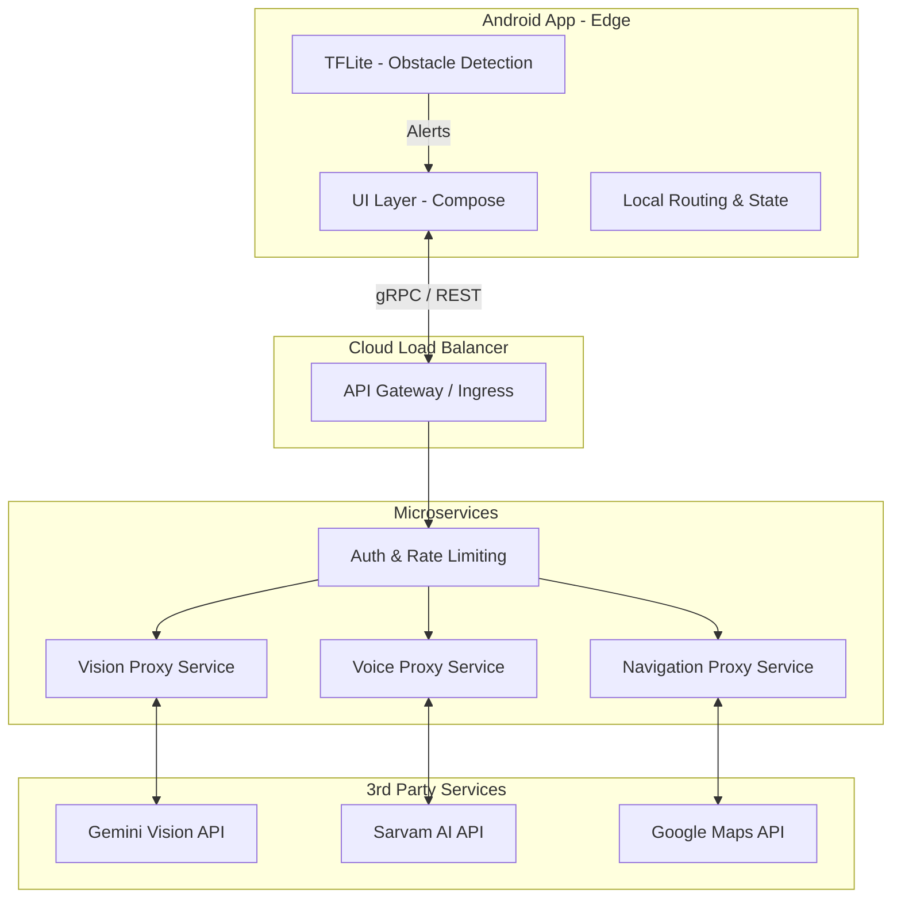
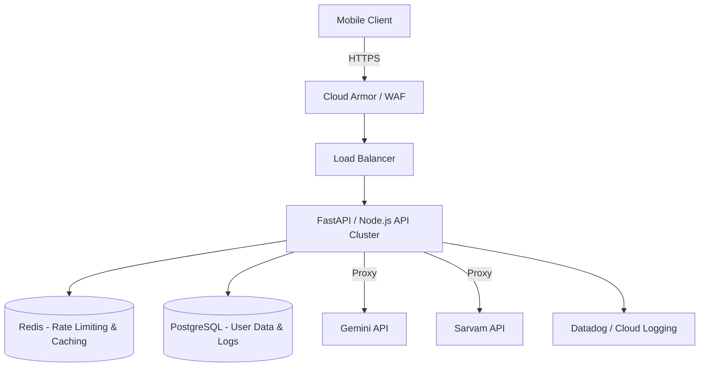
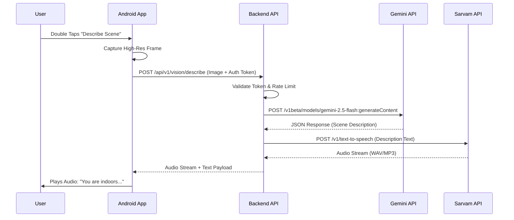

# Assistive Vision – Startup-Grade Scalable System Blueprint

## 1. Full Scalable Architecture Diagram



## 2. Mobile App Module Breakdown

- **app-core**: Base classes, DI setup (Hilt), global utilities, and extension functions.
- **feature-navigation**: Google Maps SDK integration, location tracking, turn-by-turn logic.
- **feature-vision**: CameraX pipeline, TFLite object detection, frame extraction for Gemini.
- **feature-voice**: Audio recording, local wake-word detection, playback management.
- **feature-assistant**: Conversational state machine, intent routing.
- **data-remote**: Retrofit/Ktor clients for communicating with the custom backend.
- **data-local**: DataStore for user preferences (language, settings).
- **design-system**: Reusable Compose UI components (AccessibleButton, high-contrast themes).

## 3. Backend Architecture Diagram



## 4. API Flow Sequence Diagram



## 5. Kotlin Project Structure

```text
com.assistivevision.app
├── core
│   ├── di              # Hilt Modules
│   ├── network         # Authenticated Interceptors
│   └── utils           # Permissions, Lifecycle
├── data
│   ├── local           # DataStore (Language, Auth Tokens)
│   └── remote          # API Interfaces (Backend only, NO 3rd party keys)
├── domain
│   ├── models          # Domain entities
│   └── usecases        # e.g., GetSceneDescriptionUseCase
├── features
│   ├── navigation      # Maps, GPS, Route UI
│   ├── vision          # CameraX, TFLite, Object/Currency/Scene UI
│   ├── voice           # Voice AI Guide UI
│   └── settings        # Language Selection UI
└── services
    └── SafetyService   # Foreground Service for TFLite
```

## 6. Backend Project Structure (Node.js / Express)

```text
assistive-vision-backend
├── src
│   ├── config          # Environment variables (dotenv)
│   ├── controllers     # Route handlers (vision, voice, nav)
│   ├── middlewares     # Auth (JWT), Rate Limiting, Error Handling
│   ├── routes          # Express router definitions
│   ├── services        # GeminiClient, SarvamClient wrappers
│   └── utils           # Logger (Winston), Validators
├── package.json
└── .env                # GEMINI_API_KEY, SARVAM_API_KEY
```

## 7. TensorFlow Lite Integration Example (On-Device Safety)

```kotlin
// Running in a background thread within SafetyService
class ObstacleDetector(context: Context) {
    private val detector: ObjectDetector

    init {
        val options = ObjectDetector.ObjectDetectorOptions.builder()
            .setMaxResults(3)
            .setScoreThreshold(0.6f)
            .build()
        detector = ObjectDetector.createFromFileAndOptions(context, "ssd_mobilenet_v1.tflite", options)
    }

    fun analyzeFrame(imageProxy: ImageProxy, onDanger: (String) -> Unit) {
        val mediaImage = imageProxy.image ?: return
        val image = TensorImage.fromBitmap(mediaImage.toBitmap())
        
        val results = detector.detect(image)
        val dangerous = results.find { it.categories[0].label in listOf("car", "wall", "stairs") }
        
        if (dangerous != null) {
            onDanger("Stop. ${dangerous.categories[0].label} ahead.")
        }
        imageProxy.close()
    }
}
```

## 8. Gemini Backend Proxy Example (Node.js)

```javascript
// src/services/geminiService.js
const { GoogleGenAI } = require('@google/genai');
const ai = new GoogleGenAI({ apiKey: process.env.GEMINI_API_KEY });

exports.describeScene = async (base64Image) => {
    try {
        const response = await ai.models.generateContent({
            model: 'gemini-2.5-flash',
            contents: [
                { inlineData: { data: base64Image, mimeType: 'image/jpeg' } },
                "Describe the surroundings concisely for a blind person. Max 2 short sentences."
            ]
        });
        return response.text;
    } catch (error) {
        console.error("Gemini Error:", error);
        throw new Error("Vision service unavailable.");
    }
};
```

## 9. Sarvam Integration Example (Backend Proxy)

```javascript
// src/services/sarvamService.js
const axios = require('axios');

exports.textToSpeech = async (text, languageCode) => {
    try {
        const response = await axios.post('https://api.sarvam.ai/v1/text-to-speech', {
            text: text,
            language_code: languageCode,
            speaker: "meera"
        }, {
            headers: { 'Authorization': `Bearer ${process.env.SARVAM_API_KEY}` },
            responseType: 'arraybuffer'
        });
        return response.data; // Return audio buffer to mobile client
    } catch (error) {
        console.error("Sarvam Error:", error);
        throw new Error("Voice service unavailable.");
    }
};
```

## 10. Performance Optimization Blueprint

- **Mobile**:
  - **Camera Throttling**: TFLite runs at exactly 5 FPS. Drop intermediate frames to save battery.
  - **Image Compression**: Downscale images to 640x640 and compress to 70% JPEG quality before sending to the backend.
  - **Coroutines**: Use `Dispatchers.Default` for image processing and `Dispatchers.IO` for network calls.
- **Backend**:
  - **Connection Pooling**: Keep HTTP connections alive to Google and Sarvam APIs.
  - **Streaming**: Stream audio bytes directly from Sarvam to the mobile client without buffering the entire file in memory.

## 11. Deployment Strategy (Cloud)

- **Infrastructure**: Google Cloud Platform (GCP).
- **Compute**: Cloud Run (Serverless containers) for auto-scaling from 0 to 1000s of instances based on traffic.
- **API Gateway**: Cloud Endpoints or API Gateway for routing and API key management (if exposing public APIs).
- **CI/CD**: GitHub Actions to build Docker images and deploy to Cloud Run automatically on `main` branch merges.

## 12. Monitoring and Logging Strategy

- **Backend Logging**: Use Winston/Pino to log structured JSON. Send logs to Google Cloud Logging.
- **Mobile Crashlytics**: Firebase Crashlytics for fatal and non-fatal Android crashes.
- **Performance Monitoring**: Firebase Performance Monitoring to track API latency (App -> Backend) and cold start times.
- **Alerting**: Set up PagerDuty/Slack alerts if Backend 5xx error rate exceeds 1% or if latency spikes above 1.5s.

## 13. Cost Optimization Plan

- **Tiered AI Usage**: Use Gemini 2.5 Flash (highly cost-effective) for 99% of tasks. Only use Pro models if absolutely necessary.
- **Caching**: Cache static TTS responses (e.g., "How can I help you?", "Navigating to...") on the mobile device or via Redis on the backend to avoid hitting Sarvam API repeatedly.
- **Edge Compute**: Push as much processing to the edge (TFLite) as possible. Only send images to the cloud when the user explicitly requests a description or object find.

## 14. Future Scalability Roadmap

- **Phase 1 (Launch)**: Monolithic Node.js backend on Cloud Run. Basic TFLite obstacle detection.
- **Phase 2 (Growth)**: Microservices split (Vision Service, Voice Service). Custom trained YOLOv8 model for highly accurate Indian-context obstacle detection (potholes, auto-rickshaws).
- **Phase 3 (Scale)**: WebSockets/gRPC for ultra-low latency continuous streaming. Integration with smart glasses (hardware expansion).
